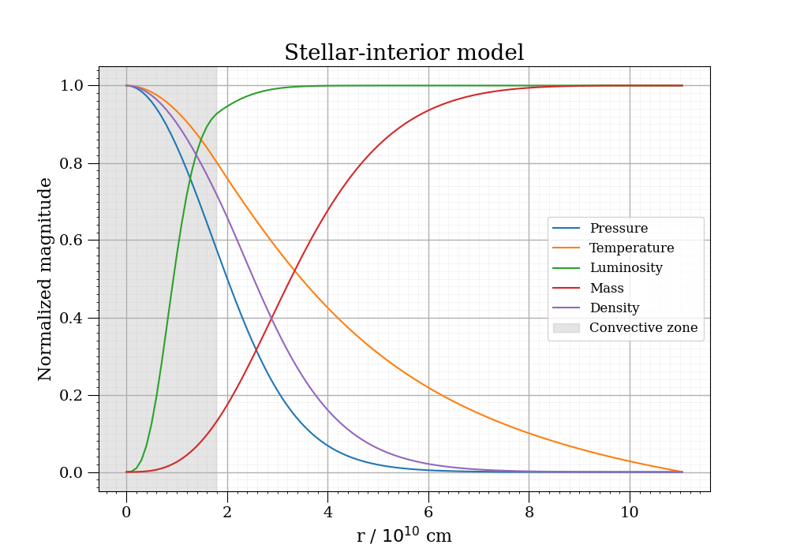

# Stellar-interior numerical model

#### Python module for solving the stellar-interior equations.

 - Author: **Nuno Cerviño Luridiana**
 - Last update: February, 2025

**Technology:** `Python`, `numerical methods`


# Installation

Clone the repository to your local machine.

```sh
!git clone https://github.com/gallati/stellar-interior-numerical-model
```

Add the module route to Python search.

```sh
import sys
sys.path.insert(0,'./stellar-interior-numerical-model')
```

Import the model object.

```sh
from model import Model
```

Enjoy!

# Model object usage


## Initialization

The `Model` object takes the following initial parameters:

- `Mtot` (float, default = 5.0) : total mass of the star.
- `Rtot` (float, default = 11.5) : total radius of the star.
- `Ltot` (float, default = 70.0) : total luminosity of the star.
- `Tc` (float, default = 2.0) : central temperature of the star.

Once the object is initialized, it estimates the numerical value of radius, pressure, temperature, mass, luminosity and density throughout a star with the given initial parameters.


## Methods

Several built-in methods are provided for the `Model` object.

* `get()`

    Function to access variables. Parameters:

    * `variable` (string, default = 'all'): 
    If default ('all'), a Data Frame object is returned containing the calculated values of the variables. For queries on specific variables you must enter one of the following strings: 'r', 'P', 'T', 'L', 'M' and 'rho'

* `error()`

    Returns total relative error of the numerical calculation of the star-interior model.

* `visualize()`
    
    Function to graph the calculated variables. Parameters:

    * `x_axis` (string, default = 'r'): String to select the independent variable of the plot. It can only be one of the variables calculated with the model: 'r', 'P', 'T', 'L', 'M' and 'rho'.

    * `which` (array-like, default = ['P', 'T', 'L', 'M', 'rho']): Array-like containing the dependent variables desirable to plot in string format. Supports the same values as x_axis: 'r', 'P', 'T', 'L', 'M' and 'rho'.

    * `merge` (bool, default = False): If True, it plots all variables specified in 'which' normalized in the same figure. If False, it plots all variables specified in 'which' without normalizing in different figures.

    * `solar_units` (bool, default = True): If True, all plots will be graphed using solar units. If False, all plots will be graphed using the model units.

    * `figsize` (two-dimensional array-like, default = (10, 7)): Two-dimensional array-like for a better customization on the figures size.

* `TDD()`

    Function to plot the Temperature-Density Diagram, i.e. the values throughout the star for temperature and density. Several regions are distinguished depending on the dominant pressure:

    I: ideal gas. II: degeneracy. III: relativistic degeneracy. IV: radiation pressure.

    * `figsize` (two-dimensional array-like, default = (10, 7)): Two-dimensional array-like for a better customization on the figures size.


## Units

In order to properly estimate the variables of the star, the unit system adopted for parameter input and results interpretation varies with respect to CGS.

    radius (r)                         ->   1e10 cm
    pressure (P)                       ->   1e15 dyn cm^-2
    temperature (T)                    ->   1e7 K
    mass (M)                           ->   1e33 g
    luminosity (L)                     ->   1e33 erg s^-1
    density (rho)                      ->   1 g cm^-3
    energy generation rate (epsilon)   ->   1 erg g^-1 s^-1
    opacity (kappa)                    ->   1 cm^2 g^-1


## Usage example

Let us compute the value of the stellar-interior variables for a star with the follwing parameters:

$$M = 2.51 M_\odot \quad R = 1.59 R_\odot \quad L = 19.76 L_\odot \quad T_c = 1.9554\cdot10^7 \text{K}$$

To do so, the `Model` object is initialized as shown.

```sh
model = Model(Mtot = 5.0, Rtot = 11.0570, Ltot = 75.9213, Tc = 1.9554)
```

The `get()` method is required to access, for example, the effective temperature $T_{\text{eff}}$ of the star.

```sh
T = model.get(variable = 'T')
Teff = T.iloc[0]
print(Teff)
```
```sh
[Output] 0.0005125238763055535
```

Which leads us to the result $T_{\text{eff}}=5125 \text{K}$

For the visualization of variables throughout the star the `visualize()` method is needed.

```sh
model.visualize(x_axis = 'r', which = ["P", "T", "L", "M", "rho"], merge = True)
```

 


License
----

**Free Software!** 
For the benefit of everyone.