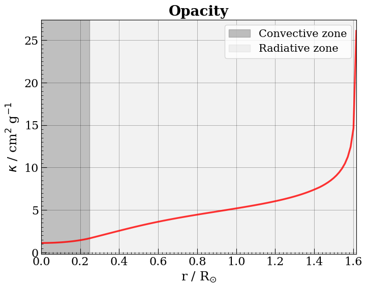

<p align="center">
  
</p>

---

Python module for solving the stellar-interior equations.

 - Author: **Nuno Cerviño Luridiana**
 - Last update: March, 2025

It provides:

* A Star object to model massive stars.
* Two different functions to optimize modeling.
* A 351 stars data set for Hertzsprung-Russell diagram representation.


# Installation

Using the terminal, clone this repository to your local machine.

```sh
git clone https://github.com/gallati/stellar-interior-numerical-model
```

Enter the cloned directory and install the package.

```sh
cd stellarpy/pip install .
```

Now you can access all StellarPy functionalities!


# Star class

Represents a star with a given mass and chemical composition. To preform the stellar-interior numerical calculation, initial values for radius, luminosity and central temperature are required. How ever, StellarPy provides the functions `error_table` and `find_minimum` to optimize which values better depict the star.

## Atributes

The `Star` object takes the following initial parameters:

* `Mtot` (QuantityLike, default = 5.0): Total mass of the star.
* `Rtot` (QuantityLike, default = 11.5): Total radius of the star.
* `Ltot` (QuantityLike, default = 70.0): Total luminosity of the star.
* `Tc` (QuantityLike, default = 2.0): Central temperature of the star.
* `X` (QuantityLike, default = 0.75): Fraction of star mass in H.
* `Y` (QuantityLike, default = 0.22): Fraction of mass in He.

Once the object is initialized, a numerical estimation for radius, pressure, temperature, mass, luminosity, density, energy generation rate and opacity throughout the star is performed.


## Methods

Several built-in methods are provided for the `Star` object.

* `get`

    Returns the requested Star instance data. Arguments:

    * `variable` (string, default = 'all'):
        If default ('all'), a Data Frame object is returned containing the calculated values of the variables. 
        For queries on specific variables you must enter one of the following strings: 'r', 'P', 'T', 'l', 'm', 'rho', 'epsilon' or 'kappa'.

    * `input_units` (bool, default = True):
        If True, requested data will be expressed using the same units as those used to initialize the Star instance. If False, model internal units will be used to express the requested data.


* `parameters`
    
    Returns Star instance atributes as a list following the order: [Mtot, Rtot, Ltot, Tc, X, Y]


* `redefine`

    Redefines Star instance atributes. Arguments:

    * `Mtot` (QuantityLike, default = None): Total mass of the star.
    * `Rtot` (QuantityLike, default = None): Total radius of the star.
    * `Ltot` (QuantityLike, default = None): Total luminosity of the star.
    * `Tc` (QuantityLike, default = None): Central temperature of the star.
    * `X` (QuantityLike, default = None): Fraction of star mass in H.
    * `Y` (QuantityLike, default = None): Fraction of mass in He.


* `error`

    Returns the percentage of total relative error of the numerical calculation of the star-interior model.


* `visualize`
    
    Graphical representation of the calculated variables throughout the star. Arguments:
        
    * `x_axis` (string, default = 'r'): 
        String to select the independent variable of the plot from the following: 
        'r', 'P', 'T', 'l', 'm', 'rho', 'epsilon' and 'kappa'.

    * `which` (array-like, default = ['P', 'T', 'l', 'm', 'rho']): 
        Array-like containing the dependent variables desirable to plot in string format.
        Supports the same values as x_axis: 'r', 'P', 'T', 'l', 'm', 'rho', 'epsilon' and 'kappa'.

    * `merge` (bool, default = False):
        If True, all variables specified in 'which' are graphed in the same figure.
        If False, all variables specified in 'which' are graphed in different figures.

    * `normalize` (bool, default = True):
        If True, all plots will be graphed using normalized units.
        If False, all plots will be graphed using a mix between cgs and solar units.

    * `figsize` (two-dimensional array-like, default = (8, 6)):
        Two-dimensional array-like for a better customization on the figures size.


* `TDD`

    Graphical representation of the star variables in the Temperature-Density Diagram. Several regions are distinguished depending on the dominant pressure. I: ideal gas. II: degeneracy. III: relativistic degeneracy. IV: radiation pressure.


* `HR`

    Graphical representation of the star in the Hertzsprung–Russell Diagram.


## Units

In order to properly estimate the variables of the star, the unit system adopted for internal calculations of the model varies with respect to CGS. However, both input and output values of the model can be expressed in any unit system using Quantity objects from astropy.

    radius (r)                         ->   1e10 cm
    pressure (P)                       ->   1e15 dyn cm^-2
    temperature (T)                    ->   1e7 K
    mass (M)                           ->   1e33 g
    luminosity (L)                     ->   1e33 erg s^-1
    density (rho)                      ->   1 g cm^-3
    energy generation rate (epsilon)   ->   1 erg g^-1 s^-1
    opacity (kappa)                    ->   1 cm^2 g^-1


# Optimization functions

StellarPy provides two function to optimize which values better depict the star.

* `error_table`

    Table containing the total relative error for total luminosity and total radius variations. Given a Star object, total relative error for variations of Ltot and Rtot is computed. Arguments:

    * `star` (Star): 
        Star object for which the minimum must be found.

    * `n` (float):
        Size of the maximum variation. The output table length will be (2*n+1).

    * `dR` (float, default = 0.5): 
        Total radius variation.

    * `dL` (float, default = 5.0): 
        Total luminosity variation.
    
    * `numbering` (bool, default = False):
        Enables table numbering.


* `find_minimum`
    
    Total relative error minimum finder for Star objects. Arguments:

    * `star` (Star):

        Star object for which the minimum must be found.

    * `x0` (list, default = None): 

        List containing specific initial parameters required for the minimum search, listed as [Rtot, Ltot, Tc] in model units. If no list is provided, current parameters of the Star object will be used.

    Returns:

    Optimized parameters and total relative error as a list following the order `[Rtot, Ltot, Tc, error]`.

# Usage example

StellarPy provides a Jupyter Notebook file in which an example is followed through. Here are some of the results achieved in that file.

Let us build a model for the brightest star in the constellation of Aquila, Altair. As total mass and chemical composition, we will consider K. Bouchaud results.

$$M = 1.86 M_\odot \quad X=0.710 \quad Y=0.271$$

As initial parameters for the rest of the magnitudes we will consider as follows:

$$R = 1.5R_\odot \quad L = 10L_\odot \quad T_c = 1.5\cdot10^7\text{K}$$

This way, the `Star` object is initialized as shown.

```sh
Altair = Star(Mtot=1.86, Rtot=1.5, Ltot=10.0, Tc=1.5e7, X=0.710, Y=0.271, solar_units=True)
```

In order to quantify how great our initial choice of parameters is, let us invoke the `error` method.

```sh
Altair.error()
```
```sh
[Output]: 104.11701982066045
```

This result can be improved significatibly optimizing our model by using the function `find_minimum`.

```sh
Rmin, Lmin, Tmin, error_min = find_minimum(star=Altair, x0=None)
Altair.redefine(Rtot=Rmin, Ltot=Lmin, Tc=Tmin)
```
```sh
[Output]: 
Minimum found at: 
   Rtot = 8.6904
   Ltot = 33.2764
   Tc   = 1.8971
Error: 0.0355 %
```
Now that the star is well defined, let's plot some cool graphs! 

## Variables throughout the star

```sh
Altair.visualize(merge=True, figsize=(10, 6))
```

<p align="center">
  
</p>

## Energy generation rate and opacity

```sh
Altair.visualize(which=["kappa", "epsilon"], normalize=False)
```

<div align="center">
  
  
</div>


## Teperature-Density Diagram

```sh
Altair.TDD()
```

<p align="center">
  
</p>

## Hertzsprung–Russell Diagram

```sh
Altair.HR()
```
<p align="center">
  
</p>

License
----

**Free Software!** 
For the benefit of everyone.